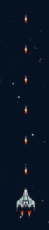
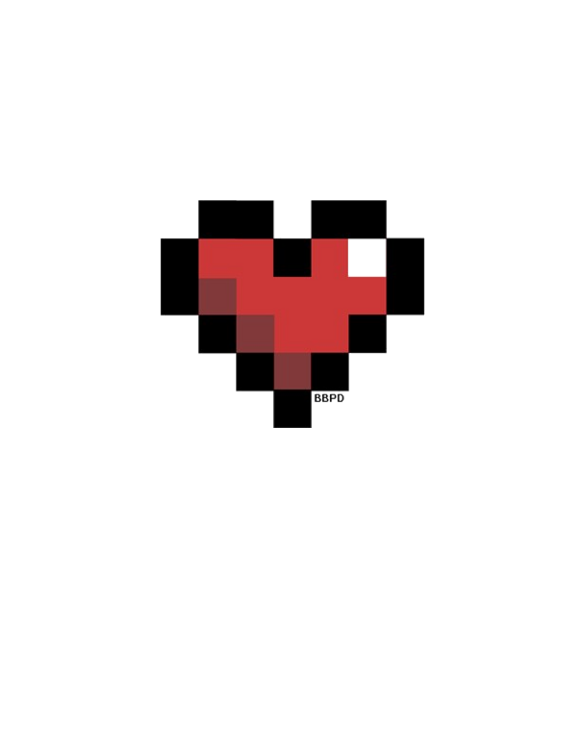

  

  <strong>Welcome to Spaceship a game where you control a spaceship in search of a better future, on the way you will meet enemies who want to hinder your path, get rid of them, not the weapons equipped on your ship and use the power ups that you are going to go finding on the way</strong>

## Technologies

  <strong>This project was made with the Python programming language and with the Pygame library.</strong>

## History

  <strong>This project was born as a participation of Jala University's admission module 2 for five days. Class was taught and homework was given to continue the base version of the game, then they left us creative freedom to implement new features.</strong>

## New features

### HEAVY MACHINE GUN

  

  

  <strong>Heavy machine gun increases the rate of fire of the bullets for the random duration of the power.</strong>

### ADD MUSIC AND SOUND EFFECTS

  <strong>Added background music that starts as soon as the application is launched, sound effects of shooting when the ship makes the option to shoot and sound effect when the ship picks up a power up.</strong>

### FONT CHANGE

  <strong>A way to change the font type to the desired font is implemented as long as we have it inside the game files, with this implementation the game title "Welcome to Spaceship" is created.</strong>

### ADD BUTTON PLAY

  

  <strong>The game in its original version has as a way to start "press Any Key to star" this way of starting is eliminated and the play button is implemented. This works with an image and it is checked when the position of the mouse is on the image and when click when the conditions are met the game starts.</strong>

### ADD LIFE COUNTER

  

  <strong>Originally in the game the player only had one life and if he was shot dead, a death counter was added for the player and the lives he has are printed on the screen in the form of a heart.</strong>

## Author

  <strong>Andres Felipe Vela Florez</strong>

